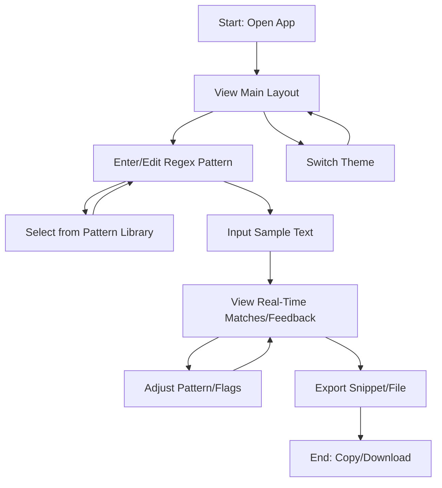
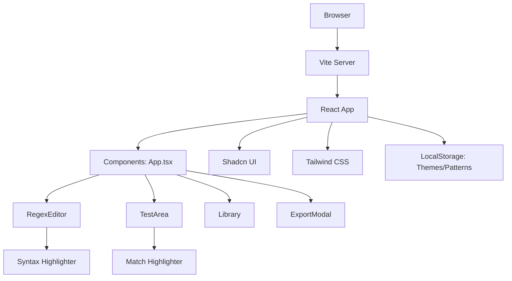

# Regex Builder Diagrams

## User Flow Diagram

```mermaid
flowchart TD
    A[Start: Open App] --> B[View Main Layout]
    B --> C[Enter/Edit Regex Pattern]
    C --> D[Select from Pattern Library]
    D --> C
    C --> E[Input Sample Text]
    E --> F[View Real-Time Matches/Feedback]
    F --> G[Adjust Pattern/Flags]
    G --> F
    F --> H[Export Snippet/File]
    H --> I[End: Copy/Download]
    B --> J[Switch Theme]
    J --> B
```

## Architecture Diagram

```mermaid
graph TD
    A[Browser] --> B[Vite Server]
    B --> C[React App]
    C --> D[Components: App.tsx]
    D --> E[RegexEditor]
    D --> F[TestArea]
    D --> G[Library]
    D --> H[ExportModal]
    E --> I[Syntax Highlighter]
    F --> J[Match Highlighter]
    C --> K[Shadcn UI]
    C --> L[Tailwind CSS]
    C --> M[LocalStorage: Themes/Patterns]
```
